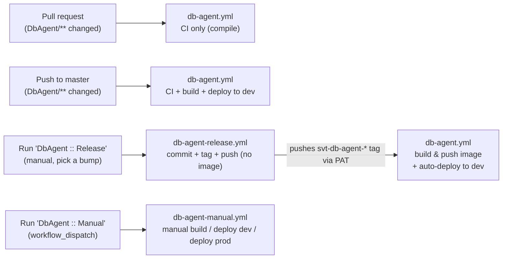
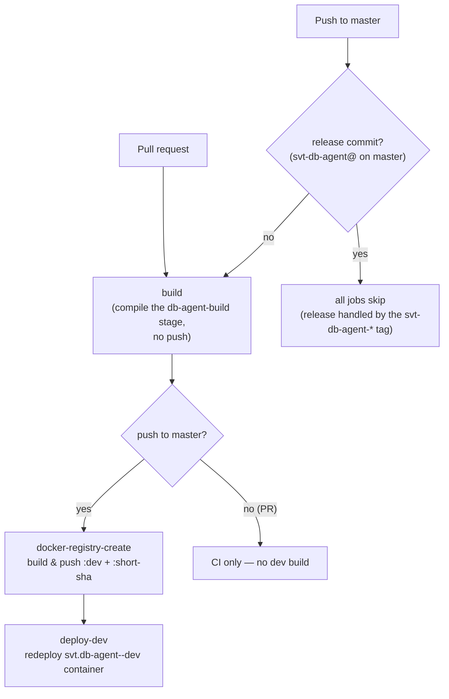
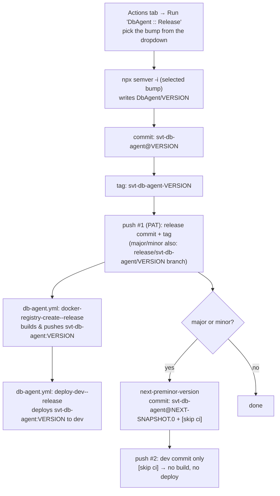
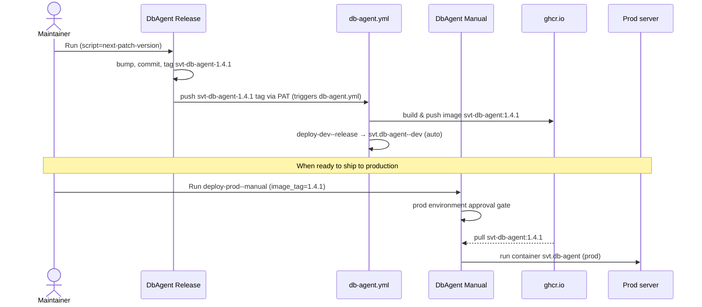

# SVT DB Agent

C++ service that bridges Kafka and the project database for EpicMeasure: it consumes request
messages from Kafka, runs the matching database operations, and publishes the results back. It is
built and shipped as a Docker image the same way the [UI](../UI/README.md) is.

## Docker Usage

```
docker compose run --rm `
  -e SVT_DB_AGENT_DB_HOST=dbod-svt-sw-pgdb.cern.ch `
  -e SVT_DB_AGENT_DB_PORT=6600 `
  -e SVT_DB_AGENT_DB_USER=admin `
  -e SVT_DB_AGENT_DB_PASS=123456`
  -e SVT_DB_AGENT_DB_NAME=svt_sw_db `
  -e SVT_DB_AGENT_DB_SCHEMA=main `
  -e SVT_DB_AGENT_KAFKA_SERVER=localhost `
  -e SVT_DB_AGENT_KAFKA_PORT=9092 `
  svt-db-agent
```

## Versioning

DbAgent uses **per-service versioning** with a **SNAPSHOT dev cycle** — the same strategy as the
[UI](../UI/README.md). `master` sits on a `-SNAPSHOT.N` pre-release (e.g. `1.4.0-SNAPSHOT.0`), and
a release **promotes** it to a stable SemVer (`1.4.0`). The next version is computed with
[node-semver](https://github.com/npm/node-semver) (`npx semver`, the same engine the UI's
`npm version` uses), so the math is byte-identical across both services. See
[GitHub Actions (CI/CD)](#github-actions-cicd) below for how a release is cut and deployed.

- **Source of truth:** [`VERSION`](VERSION) (plain text — the only place the version lives).
- **Git tag:** `svt-db-agent-<version>` (e.g. `svt-db-agent-1.4.0`)
- **Release commit:** `svt-db-agent@<version>`
- **Release branch** (major/minor only): `release/svt-db-agent/<version>`
- **Image:** `ghcr.io/svt-wp2/svt-db-agent:<version>`; `:latest` tracks the newest **stable**
  (non-SNAPSHOT) release.

### How the version reaches the binary

`compile.sh` resolves the version as **`$VERSION` env (set by CI/Docker) → the `VERSION` file**,
passes it to CMake as `-DVERSION=...`, which generates `version.h` from
[`app/version/version.h.in`](app/version/version.h.in). The agent logs it at startup
(`Svt Db Agent, version:<version>`).

- **Release builds** get `$VERSION` from the git tag (stripped of the `svt-db-agent-` prefix).
- **Dev / master builds** get the short commit SHA.
- **Local builds** (no `$VERSION`) read the `VERSION` file (a `-SNAPSHOT.N` string).

### Previewing a bump locally

```bash
cd DbAgent
CURRENT="$(cat VERSION)"
npx --yes semver@7 -i minor "$CURRENT"                       # what next-minor-version would produce
npx --yes semver@7 -i preminor --preid SNAPSHOT "$CURRENT"   # what next-preminor-version would produce
```

## GitHub Actions (CI/CD)

All DbAgent automation lives in [`.github/workflows`](../.github/workflows):

| Workflow file | Trigger | Purpose |
|---|---|---|
| `db-agent.yml` (`DbAgent`) | PR, push to `master`, `svt-db-agent-*` tag | CI (compile gate on PR + master); dev build & deploy on master pushes and on `svt-db-agent-*` tags |
| `db-agent-release.yml` (`DbAgent :: Release`) | Manual (`workflow_dispatch`) | Create a release: bump → commit + tag + push (no image; `db-agent.yml` builds it from the tag) |
| `db-agent-manual.yml` (`DbAgent :: Manual`) | Manual (`workflow_dispatch`) | Manual ops: build a short-SHA image, deploy an image to dev, deploy a release to prod |

> `db-agent.yml` runs for PRs/pushes only when they touch `DbAgent/**` or `.github/workflows/db-agent.yml`.
> (Per GitHub, path filters are **not** evaluated for tag pushes.)
>
> `DbAgent :: Release` only creates the commit + tag; **`db-agent.yml` builds the release image** when
> the `svt-db-agent-*` tag is pushed. That push must use a **`RELEASE_PAT`** secret — a tag pushed with
> the default `GITHUB_TOKEN` does not trigger other workflows.
>
> Images are published to `ghcr.io/svt-wp2/svt-db-agent`.

### Triggers overview



### Scenario 1 — Pull request

A PR touching `DbAgent/**` runs **CI only**: it builds the `db-agent-build` Dockerfile stage (a
**compile-only** check) without pushing. No runtime image is built and nothing is deployed.

### Scenario 2 — Push to master

The same compile check runs, then the runtime image is built and **deployed to dev automatically**.



- `docker-registry-create` builds the `db-agent` runtime stage and pushes
  `ghcr.io/svt-wp2/svt-db-agent:dev` and `:<short-sha>` (with `VERSION=<short-sha>`).
- `deploy-dev` redeploys the `svt.db-agent--dev` container on the self-hosted runner.
- **Release commits are a no-op here:** every job skips `svt-db-agent@` master-push commits (the gate
  above), so a release never triggers CI or a dev build/deploy on `master` — the `svt-db-agent-*` tag
  does the build + dev-deploy (Scenario 3).

### Scenario 3 — Create a release

Releases are **manual**: **Actions → `DbAgent :: Release` → Run workflow → pick the bump from the
`script` dropdown → choose the branch (usually `master`) → Run.**

`DbAgent :: Release` does **git only** — bump `DbAgent/VERSION`, commit, tag, push. It builds **no**
image. Pushing the `svt-db-agent-*` tag triggers `db-agent.yml`'s `docker-registry-create--release`,
which builds and pushes the image. This needs a **`RELEASE_PAT`** secret (a tag pushed with
`GITHUB_TOKEN` would not trigger `db-agent.yml`).

The `script` options and what they produce — from a typical `master` SNAPSHOT, and from a
`release/svt-db-agent/<version>` branch (where the version is already stable, e.g. for a patch):

| `script` choice | From `1.4.0-SNAPSHOT.0` (master) | From `1.4.0` (release branch) | `:latest`? | 2nd commit (`[skip ci]`) | Release branch |
|---|---|---|---|---|---|
| `next-major-version` | `2.0.0` | `2.0.0` | yes | `svt-db-agent@2.1.0-SNAPSHOT.0` | `release/svt-db-agent/<v>` |
| `next-minor-version` (default) | `1.4.0` | `1.5.0` | yes | `svt-db-agent@1.5.0-SNAPSHOT.0` | `release/svt-db-agent/<v>` |
| `next-patch-version` | `1.4.0` | `1.4.1` | yes | — | — |
| `next-preminor-version` | `1.5.0-SNAPSHOT.0` | `1.5.0-SNAPSHOT.0` | no | — | — |
| `next-snapshot-version` | `1.4.0-SNAPSHOT.1` | `1.4.1-SNAPSHOT.0` | no | — | — |

> **node-semver rule:** from a `.0`-patch SNAPSHOT, `major`/`minor`/`patch` all just **drop** the
> SNAPSHOT (a `-SNAPSHOT.N` *is* the in-development version), so they collapse to the same number
> on `master`. Cut a **patch** from the `release/svt-db-agent/<version>` branch, where the version is
> already stable. This matches the UI exactly.



Key points:

- `DbAgent :: Release` builds **no** image — `db-agent.yml` does, triggered by the `svt-db-agent-*`
  tag. This needs a **`RELEASE_PAT`** secret (classic PAT with `repo`, or fine-grained with
  Contents: Read and write).
- **Major/Minor** open the next dev cycle with a **second, separate push**: a
  `svt-db-agent@…-SNAPSHOT.0` commit carrying `[skip ci]` (on its own line, hidden from the one-line
  log). It is **not tagged** and **not built/deployed** — `[skip ci]` stops it from triggering any
  `db-agent.yml` run.
- **Major/Minor** also create a `release/svt-db-agent/<version>` branch pointing at the release commit
  (pushed atomically with the tag, before `master` advances to the SNAPSHOT). It's a stable pointer for
  that release and doesn't trigger CI — `db-agent.yml` only watches `master`.
- The image is built from the **released** commit (push #1), so e.g. `svt-db-agent:2.0.0` contains
  `2.0.0` — not the snapshot.
- Every release **auto-deploys to dev**: after the image is built, `deploy-dev--release` runs it on the
  `svt.db-agent--dev` container (any release type, including SNAPSHOTs). Prod stays manual (Scenario 4).
- `:latest` is moved only by **stable** releases (`next-major-version` / `next-minor-version` /
  `next-patch-version`); the SNAPSHOT bumps (`next-preminor-version` / `next-snapshot-version`) don't touch it.
- Releases **skip CI**: the `svt-db-agent-*` tag build (`docker-registry-create--release` →
  `deploy-dev--release`) runs **without** the compile gate — `db-agent.yml` builds the runtime image
  straight from the tag. The release commit's own master push is a no-op (all jobs skip `svt-db-agent@`
  commits; a skipped run entry still shows). The compile gate runs on PRs and normal master pushes.
- The workflow must exist on the **default branch** for its Run button to appear, and it pushes
  straight to the branch you run it from.

### Scenario 4 — Deploy a release to production

Dev is deployed automatically — on every master push (Scenario 2) **and on every release** (via
`deploy-dev--release`). **Production is always manual** and gated by the `prod` environment approval:
**Actions → `DbAgent :: Manual` → Run workflow → `job = deploy-prod--manual`,
`image_tag = <version>` (e.g. `1.4.1`).**



### Manual operations (`DbAgent :: Manual` → Run workflow)

| Job (`job` input) | `image_tag` | What it does |
|---|---|---|
| `docker-registry-create--manual` | ignored | Build & push `:<short-sha>` from the selected ref |
| `deploy-dev--manual` | optional (defaults to short-sha) | Deploy an existing image to **dev** |
| `deploy-prod--manual` | **required** | Deploy an existing release image to **prod** (approval gate) |

> The release image is built by `db-agent.yml`'s `docker-registry-create--release` whenever a
> `svt-db-agent-*` tag is pushed — by `DbAgent :: Release` (via `RELEASE_PAT`) or by hand. Without
> `RELEASE_PAT`, `DbAgent :: Release` still creates the tag, but the build won't start until the tag is
> (re)pushed by a PAT or a user.
