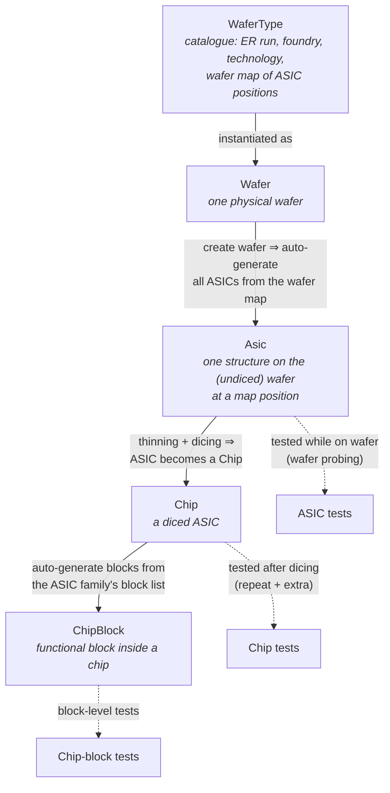
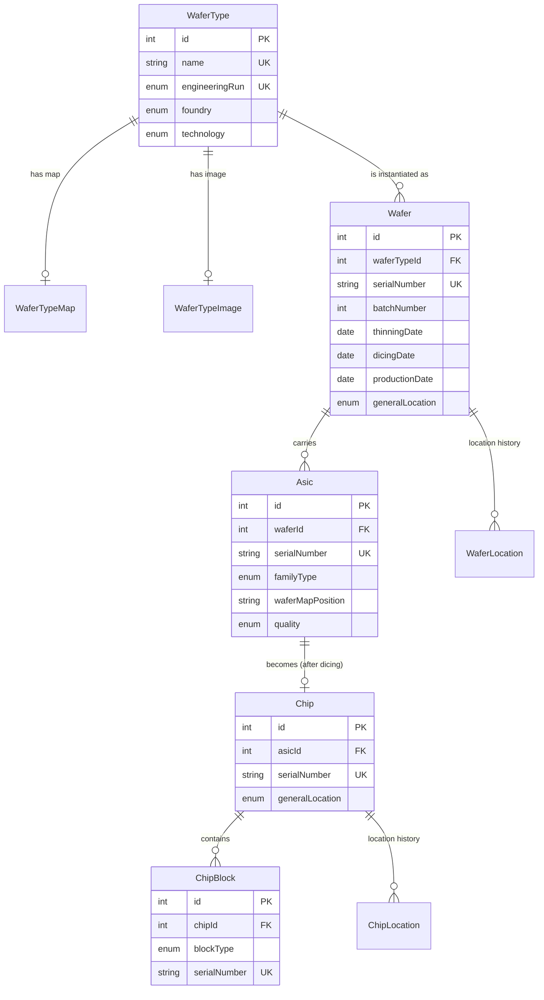
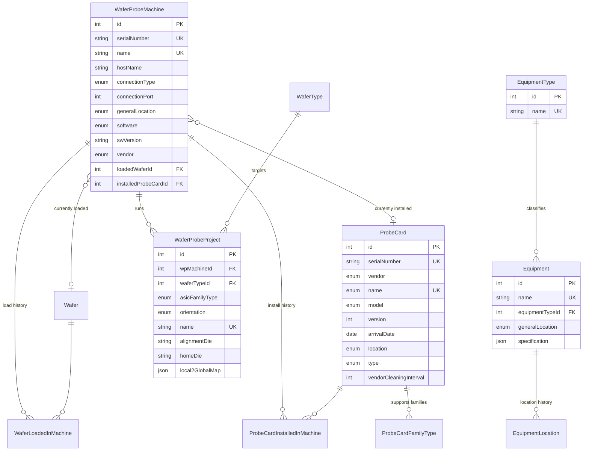
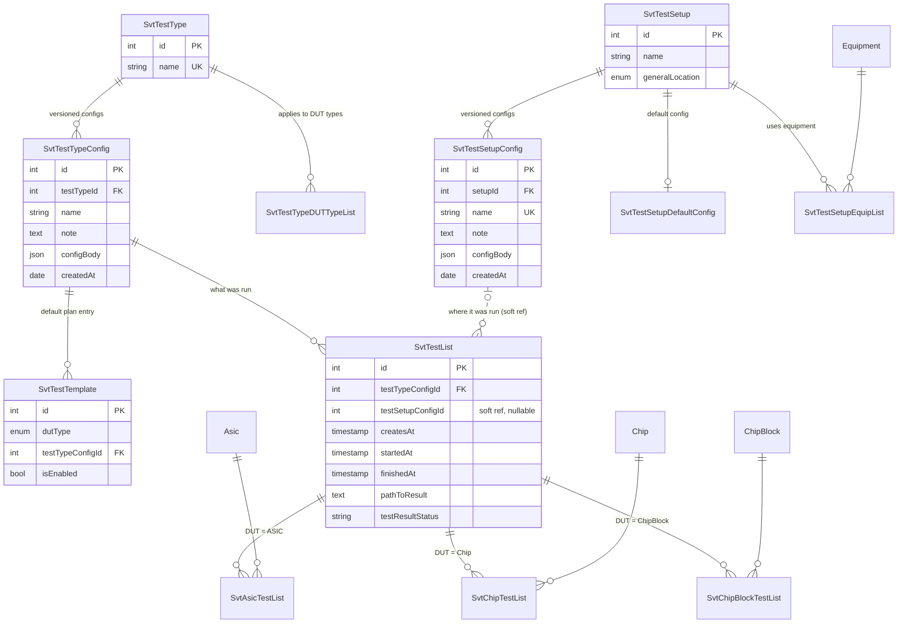

# SVT‑SW Domain Model

> Detailed description of the domain entities, their attributes and the relations
> between them, as implemented in the PostgreSQL database (`schema = main`) and
> served over Kafka by the **DbAgent** (`DbAgent/`).
>
> Source of truth for this document:
> - Database schema — [`Dev/db-example/db-example-2026-06-01.dump`](../Dev/db-example/db-example-2026-06-01.dump) (PostgreSQL 16, db `svt_sw_db_test`)
> - C++ data-access layer — [`DbAgent/app/include/DbAgentDto/`](../DbAgent/app/include/DbAgentDto)
> - Front-end entity models — [`UI/libs/epic/entities/`](../UI/libs/epic/entities)

---

## Table of contents

1. [What this system is about](#1-what-this-system-is-about)
2. [The physical lifecycle (Wafer → ASIC → Chip)](#2-the-physical-lifecycle-wafer--asic--chip)
3. [Domain areas at a glance](#3-domain-areas-at-a-glance)
4. [Entity–relationship diagrams](#4-entityrelationship-diagrams)
5. [Entity reference](#5-entity-reference)
   - [5.1 Device hierarchy](#51-device-hierarchy)
   - [5.2 Location tracking](#52-location-tracking)
   - [5.3 Equipment](#53-equipment)
   - [5.4 Wafer probing](#54-wafer-probing)
   - [5.5 Test configuration](#55-test-configuration)
   - [5.6 Test execution & results](#56-test-execution--results)
6. [Key domain rules & behaviours](#6-key-domain-rules--behaviours)
7. [Enumerations](#7-enumerations)
8. [The DbAgent Kafka interface](#8-the-dbagent-kafka-interface)
9. [Glossary](#9-glossary)

---

## 1. What this system is about

The system tracks and tests **silicon (Si) wafers** and the micro‑electronic
structures fabricated on them. The structures are **ASICs** — Monolithic Active
Pixel Sensor (MAPS) prototypes and ancillary chips (families such as `MOSAIX`,
`MOSS`, `APTS`, `DPTS`, `CE65`, `NKF7`, `AncMPW*` …) produced across several
*engineering runs* (`ER1`, `ER2`, `ER3`, …) at foundries such as Tower
Semiconductor and X‑FAB.

A wafer travels through a workflow:

1. it **arrives from the foundry** and its movements between laboratories are
   tracked (location history);
2. while still whole ("not diced") the ASICs on it are **probed and tested** on
   wafer‑probe machines;
3. the wafer is **thinned** and **diced**; each ASIC then becomes an individual
   **Chip**;
4. the chip (and the **blocks** inside it) is **tested again** — repeating the
   ASIC‑level tests and adding chip/block‑level ones.

Because testing happens **in many laboratories simultaneously** (CERN, Brunel,
Prague, BNL, RAL, …), nearly every physical entity carries a *location* and a
*location history*.

The **DbAgent** is a C++ service that exposes this database over **Apache
Kafka**. Other components (the UI back‑end, test agents, supervisors) never talk
to PostgreSQL directly — they send request messages to the DbAgent, which
performs the CRUD operation and replies. See [§8](#8-the-dbagent-kafka-interface).

---

## 2. The physical lifecycle (Wafer → ASIC → Chip)



| Stage | Entity created | How | Tested via |
|------|----------------|-----|------------|
| Catalogue | `WaferType` (+ `WaferTypeMap`, `WaferTypeImage`) | defined once per engineering run | — |
| Wafer received | `Wafer` | created by user; **the agent then auto-creates every `Asic`** from the wafer map | — |
| Wafer probing (undiced) | — | wafer is loaded into a `WaferProbeMachine` with a matching `ProbeCard` | `SvtAsicTestList` |
| Thinning / dicing | dates set on `Wafer` | `thinningDate`, `dicingDate` | — |
| Chip created | `Chip` (+ its `ChipBlock`s) | each diced ASIC → a `Chip`; **blocks auto-created** from `AsicFamilyTypeBlockList` | `SvtChipTestList`, `SvtChipBlockTestList` |

The **device under test (DUT)** is therefore polymorphic: a test run targets an
**Asic**, a **Chip**, or a **ChipBlock** (see [§5.6](#56-test-execution--results)).

---

## 3. Domain areas at a glance

| # | Area | Core entities | Junction / detail tables |
|---|------|---------------|--------------------------|
| A | **Device hierarchy** | `WaferType`, `Wafer`, `Asic`, `Chip`, `ChipBlock` | `WaferTypeMap`, `WaferTypeImage`, `AsicFamilyTypeBlockList` |
| B | **Location tracking** | — | `WaferLocation`, `ChipLocation`, `EquipmentLocation` |
| C | **Equipment** | `EquipmentType`, `Equipment` | — |
| D | **Wafer probing** | `WaferProbeMachine`, `ProbeCard`, `WaferProbeProject` | `WaferLoadedInMachine`, `ProbeCardInstalledInMachine`, `ProbeCardFamilyType` |
| E | **Test configuration** | `SvtTestType`, `SvtTestTypeConfig`, `SvtTestSetup`, `SvtTestSetupConfig`, `SvtTestTemplate` | `SvtTestTypeDUTTypeList`, `SvtTestSetupDefaultConfig`, `SvtTestSetupEquipList` |
| F | **Test execution** | `SvtTestList` | `SvtAsicTestList`, `SvtChipTestList`, `SvtChipBlockTestList` |

> **31 tables, 18 enum types**, all in schema `main`. Every primary entity uses
> an integer identity primary key named `id`; natural keys (serial numbers,
> names) are enforced with `UNIQUE` constraints.

---

## 4. Entity–relationship diagrams

The full model is split into three readable diagrams. `PK` = primary key,
`FK` = foreign key, `UK` = unique key.

### 4.1 Device hierarchy & location



### 4.2 Wafer probing & equipment



### 4.3 Test configuration & execution



---

## 5. Entity reference

Legend for the **Key** column: `PK` primary key · `FK` foreign key · `UK`
unique · `NN` not null · `J` JSON document.

### 5.1 Device hierarchy

#### `WaferType` — catalogue of wafer designs
One row per engineering‑run wafer design. Everything physical inherits its
identity from a wafer type.

| Column | Type | Key | Description |
|--------|------|-----|-------------|
| `id` | integer | PK | identity |
| `name` | varchar(50) | UK, NN | e.g. `ER1`, `ER2`, `AncMPW2` |
| `engineeringRun` | enum `engineeringRun` | UK, NN | the run this type belongs to (one type per run) |
| `foundry` | enum `foundryName` | NN | `TowerSemiconductor`, `Xfab` |
| `technology` | enum `waferTech` | NN | `TPSCo65`, `Xfab110` |

#### `WaferTypeMap` — the map of ASIC positions (1:1 with WaferType)
The JSON blueprint of **what sits where** on the wafer. This is what the agent
reads to auto-create ASICs when a wafer is registered.

| Column | Type | Key | Description |
|--------|------|-----|-------------|
| `waferTypeId` | integer | PK, FK→WaferType | |
| `waferMap` | json | NN, J | groups of `{PosInGroup, FamilyType}`, plus a `MapGroups` grid describing existing/damaged/green‑layer ASICs and orientation |

<details><summary>Example <code>waferMap</code> shape</summary>

```jsonc
{
  "FileName": "ER2WaferMap_v0.json",
  "DateOfCreation": "2025-11-16 09:14:38",
  "Revision": "0.0.0",
  "Orientation": "West",
  "Groups": {
    "Group_0": [{ "PosInGroup": 0, "FamilyType": "MOSAIX" }],
    "Group_1": [{ "PosInGroup": 0, "FamilyType": "BABYMOSAIX" }],
    "Group_2": [
      { "PosInGroup": 0, "FamilyType": "ER2_DPTS_P5" },
      { "PosInGroup": 1, "FamilyType": "ER2_APTS_OA_10_P3" }
    ]
  },
  "MapGroups": {
    "MapGroupsRow0": {
      "MapGroupsColumns": [{
        "GroupName": "Group_0",
        "Property": "WithMechanicallyIntegerASICs",
        "ExistingAsics": ["All"],
        "MechanicallyDamagedASICs": [],
        "ASICsCoveredByGreenLayer": [],
        "MechanicallyIntegerASICs": ["All"]
      }]
    }
  }
}
```
</details>

#### `WaferTypeImage` — wafer photo (1:1 with WaferType)

| Column | Type | Key | Description |
|--------|------|-----|-------------|
| `waferTypeId` | integer | PK, FK→WaferType | |
| `imageBase64String` | text | NN | base64‑encoded image of the wafer layout |

#### `Wafer` — one physical wafer

| Column | Type | Key | Description |
|--------|------|-----|-------------|
| `id` | integer | PK | identity |
| `waferTypeId` | integer | FK→WaferType, NN | the design |
| `serialNumber` | varchar(50) | UK, NN | e.g. `ER2-W1`, `AncMPW2-W1` |
| `batchNumber` | integer | NN | fabrication batch |
| `thinningDate` | date | | set when the wafer is thinned (nullable) |
| `dicingDate` | date | | set when the wafer is diced (nullable) |
| `productionDate` | date | | foundry production date (nullable) |
| `generalLocation` | enum `wpGeneralLocation` | | current lab (nullable) |

#### `Asic` — a structure on the (undiced) wafer
The fundamental device. There are **thousands per wafer** (the example dump
holds ~11 k ASIC rows), one per occupied position on the wafer map.

| Column | Type | Key | Description |
|--------|------|-----|-------------|
| `id` | integer | PK | identity |
| `waferId` | integer | FK→Wafer, NN | parent wafer |
| `serialNumber` | varchar(50) | UK, NN | derived from wafer SN + position |
| `familyType` | enum `asicFamilyType` | NN | design family (`MOSAIX`, `NKF7`, …) |
| `waferMapPosition` | varchar(50) | NN | position on the wafer (from the map) |
| `quality` | enum `asicQuality` | NN | `MechanicallyInteger` / `MechanicallyDamaged` / `CoveredByGreenLayer` |

> The front end also exposes an optional `chipId` on an ASIC — the chip it became
> after dicing (see `Chip` below).

#### `Chip` — a diced ASIC
Created when the wafer is diced. Logically **one ASIC → one Chip**.

| Column | Type | Key | Description |
|--------|------|-----|-------------|
| `id` | integer | PK | identity |
| `asicId` | integer | FK→Asic, NN | the ASIC this chip came from |
| `serialNumber` | varchar(50) | UK, NN | e.g. `AncMPW2-W1_0_0` |
| `generalLocation` | enum `wpGeneralLocation` | NN | current lab |

#### `ChipBlock` — a functional block inside a chip
Auto-created from the ASIC family's block list (see
[`AsicFamilyTypeBlockList`](#asicfamilytypeblocklist--which-blocks-each-family-has)).

| Column | Type | Key | Description |
|--------|------|-----|-------------|
| `id` | integer | PK | identity |
| `chipId` | integer | FK→Chip, NN | parent chip |
| `blockType` | enum `blockType` | NN | e.g. `AncMPW2_SLDO`, `AncMPW2_NVBG`, `AncMPW2_CML_TRANSCEIVER` |
| `serialNumber` | varchar(50) | UK, NN | e.g. `SLDO_AncMPW2-W1_0_0` |

#### `AsicFamilyTypeBlockList` — which blocks each family has
Reference mapping (both columns are enums, composite PK). Drives chip‑block
creation: when a chip of a given family is diced, one `ChipBlock` is created per
`blockType` listed here.

| Column | Type | Key |
|--------|------|-----|
| `asicFamilyType` | enum `asicFamilyType` | PK |
| `blockType` | enum `blockType` | PK |

*Example:* `AncMPW2` → `{AncMPW2_SLDO, AncMPW2_NVBG, AncMPW2_CML_TRANSCEIVER}`.

---

### 5.2 Location tracking

Three structurally identical *append‑only history* tables record where a wafer /
chip / equipment item has been. The current location is also denormalised onto
the parent (`generalLocation`); these tables keep the trail. In the C++ layer
they share the `DbLocationDto` shape (`<id>`, `generalLocation`, `date`,
`username`, `note`).

| Table | Owner FK | Columns |
|-------|----------|---------|
| `WaferLocation` | `waferId`→Wafer | `generalLocation` (NN), `date` (default today), `username`, `note` |
| `ChipLocation` | `chipId`→Chip | `generalLocation` (NN), `date` (default today), `username`, `note` |
| `EquipmentLocation` | `equipmentId`→Equipment | `generalLocation` (NN), `date` (default today), `username`, `note` |

> A row with note `"Location at creation"` is written automatically when the
> parent entity is first created.

---

### 5.3 Equipment

#### `EquipmentType`

| Column | Type | Key | Description |
|--------|------|-----|-------------|
| `id` | integer | PK | identity |
| `name` | varchar(50) | UK, NN | e.g. `Oscilloscope`, `Multimeter`, `Enclustra Card` |

#### `Equipment` — a physical instrument

| Column | Type | Key | Description |
|--------|------|-----|-------------|
| `id` | integer | PK | identity |
| `name` | varchar(50) | UK, NN | e.g. `DAQ-0009012C0D0F341D` |
| `equipmentTypeId` | integer | FK→EquipmentType, NN | classification |
| `generalLocation` | enum `wpGeneralLocation` | NN | current lab |
| `specification` | json | J | free-form device spec (often `{}`) |

---

### 5.4 Wafer probing

#### `WaferProbeMachine` — a wafer-probe (WP) station
Drives undiced-wafer testing. Note the two **denormalised "current state"**
foreign keys (`loadedWaferId`, `installedProbeCardId`) — the latest of the
respective history tables.

| Column | Type | Key | Description |
|--------|------|-----|-------------|
| `id` | integer | PK | identity |
| `serialNumber` | varchar(50) | UK, NN | |
| `name` | varchar(50) | UK, NN | e.g. `WPMIT` |
| `hostName` | varchar(200) | NN | network host |
| `connectionType` | enum `wpConnectionType` | NN | `TCPIP`, `GPIB`, … |
| `connectionPort` | integer | NN | |
| `generalLocation` | enum `wpGeneralLocation` | NN | lab |
| `software` | enum `wpSwType` | NN | `Sentio`, `VeloxCascade` |
| `swVersion` | varchar(50) | NN | |
| `vendor` | enum `wpVendor` | NN | `MPI`, `CascadeMicrotech`, `FormFactor` |
| `loadedWaferId` | integer | FK→Wafer | wafer currently on the chuck (nullable) |
| `loadedWaferOrientation` | enum `waferMapOrientation` | | |
| `installedProbeCardId` | integer | FK→ProbeCard | card currently installed (nullable) |
| `installedProbeCardOrientation` | enum `waferMapOrientation` | | |

#### `ProbeCard` — the needle card that contacts the wafer

| Column | Type | Key | Description |
|--------|------|-----|-------------|
| `id` | integer | PK | identity |
| `serialNumber` | varchar(50) | UK, NN | |
| `vendor` | enum `pcVendor` | NN | `MPI`, `Korea`, … |
| `name` | enum `pcName` | UK, NN | `NKF7_MPI`, … |
| `model` | enum `pcModel` | NN | |
| `version` | integer | NN | |
| `arrivalDate` | date | NN | |
| `location` | enum `pcLocation` | NN | `CERN`, `Prague`, … |
| `type` | enum `pcType` | NN | `Vertical`, `Cantilever` |
| `vendorCleaningInterval` | integer | NN | touch-downs between cleanings |

#### `ProbeCardFamilyType` — families a card can probe (M:N)

| Column | Type | Key |
|--------|------|-----|
| `probeCardId` | integer | PK, FK→ProbeCard |
| `asicFamilyType` | enum `asicFamilyType` | PK |

#### `WaferProbeProject` — a probing project (machine + wafer type)
Geometry/recipe binding a wafer type to a machine, including the local↔global
die coordinate mapping.

| Column | Type | Key | Description |
|--------|------|-----|-------------|
| `id` | integer | PK | identity |
| `wpMachineId` | integer | FK→WaferProbeMachine, NN | |
| `waferTypeId` | integer | FK→WaferType, NN | |
| `asicFamilyType` | enum `asicFamilyType` | | family being probed (nullable) |
| `orientation` | enum `waferMapOrientation` | | |
| `name` | varchar(100) | UK, NN | e.g. `ER2_MOSAIX_Vertical_West` |
| `alignmentDie` | varchar(100) | | reference die for alignment, e.g. `2,2` |
| `homeDie` | varchar(100) | | origin die, e.g. `0,0` |
| `local2GlobalMap` | json | J | array mapping local die coords ↔ global wafer coords |

#### `WaferLoadedInMachine` — wafer load history (M:N over time)

| Column | Type | Key | Description |
|--------|------|-----|-------------|
| `machineId` | integer | FK→WaferProbeMachine, NN | |
| `waferId` | integer | FK→Wafer, NN | |
| `orientation` | enum `waferMapOrientation` | | |
| `date` | date | | default today |
| `username` | varchar(50) | | |
| `status` | enum `waferInMachineStatus` | | `Loaded` / `Unloaded` |

#### `ProbeCardInstalledInMachine` — probe-card install history (M:N over time)

| Column | Type | Key | Description |
|--------|------|-----|-------------|
| `machineId` | integer | FK→WaferProbeMachine, NN | |
| `probeCardId` | integer | FK→ProbeCard, NN | |
| `orientation` | enum `waferMapOrientation` | | |
| `date` | date | | default today |
| `username` | varchar(50) | | |

---

### 5.5 Test configuration

The configuration side answers *"what kinds of tests exist, how are they
parameterised, and on what bench do they run"*. Both **test types** and **test
setups** keep their parameters as **versioned JSON configs** (a parent + many
named config rows), so a recipe can evolve without losing history.

#### `SvtTestType` — a kind of test

| Column | Type | Key | Description |
|--------|------|-----|-------------|
| `id` | integer | PK | identity |
| `name` | varchar(100) | UK, NN | e.g. `Impedance Test`, `StepRamp`, `SLDO_DACScan`, `SLDO_Irradiation`, `SLDO_PowerUp` |

#### `SvtTestTypeConfig` — versioned parameters of a test type

| Column | Type | Key | Description |
|--------|------|-----|-------------|
| `id` | integer | PK | identity |
| `testTypeId` | integer | FK→SvtTestType, NN | |
| `name` | varchar(100) | NN | unique together with `testTypeId` |
| `note` | text | | |
| `configBody` | json | NN, J | the test parameters |
| `createdAt` | date | | default today |

#### `SvtTestTypeDUTTypeList` — which DUT types a test type applies to (M:N)

| Column | Type | Key | Description |
|--------|------|-----|-------------|
| `dutType` | enum `dutType` | PK | `MOSAIX`, `BABYMOSAIX`, `AncMPW2_SLDO` |
| `testTypeId` | integer | PK, FK→SvtTestType | |

*Example:* `Impedance Test` & `StepRamp` apply to `MOSAIX`/`BABYMOSAIX`; the
`SLDO_*` tests apply to `AncMPW2_SLDO`.

#### `SvtTestSetup` — a physical test bench

| Column | Type | Key | Description |
|--------|------|-----|-------------|
| `id` | integer | PK | identity |
| `name` | varchar(100) | | e.g. `ts_mit`, `sldo_ts_brunel` |
| `generalLocation` | enum `wpGeneralLocation` | | lab where the bench lives |

#### `SvtTestSetupConfig` — versioned parameters of a setup

| Column | Type | Key | Description |
|--------|------|-----|-------------|
| `id` | integer | PK | identity |
| `setupId` | integer | FK→SvtTestSetup, NN | |
| `name` | varchar(100) | UK, NN | e.g. `ts_mit_config_v0` |
| `note` | text | | |
| `configBody` | json | NN, J | boards, power supplies, instruments, connections … |
| `createdAt` | date | | default today |

#### `SvtTestSetupDefaultConfig` — the default config of a setup (1:1)

| Column | Type | Key | Description |
|--------|------|-----|-------------|
| `setupId` | integer | PK, FK→SvtTestSetup | |
| `defaultConfigId` | integer | FK→SvtTestSetupConfig | which config is the default (nullable) |

#### `SvtTestSetupEquipList` — equipment used by a setup (M:N)

| Column | Type | Key |
|--------|------|-----|
| `setupId` | integer | PK, FK→SvtTestSetup |
| `equipId` | integer | PK, FK→Equipment |

#### `SvtTestTemplate` — the default test plan per DUT type
For a given `dutType`, which test‑type configs should be run by default. Unique
on `(dutType, testTypeConfigId)`; can be toggled with `isEnabled`.

| Column | Type | Key | Description |
|--------|------|-----|-------------|
| `id` | integer | PK | identity |
| `dutType` | enum `dutType` | | the device kind this plan entry targets |
| `testTypeConfigId` | integer | FK→SvtTestTypeConfig | the config to run (nullable) |
| `isEnabled` | boolean | | default `true` |

---

### 5.6 Test execution & results

#### `SvtTestList` — one test run / instance
The record of an actual (or scheduled) test execution.

| Column | Type | Key | Description |
|--------|------|-----|-------------|
| `id` | integer | PK | identity |
| `testTypeConfigId` | integer | FK→SvtTestTypeConfig, NN | **what** was run |
| `testSetupConfigId` | integer | *(soft ref, nullable)* | **where** it was run — references `SvtTestSetupConfig.id` but has no FK constraint |
| `createsAt` | timestamp | | default now |
| `startedAt` | timestamp | | nullable until started |
| `finishedAt` | timestamp | | nullable until finished |
| `pathToResult` | text | | path to the result artefacts |
| `testResultStatus` | varchar(50) | | free-form status (e.g. pass/fail/processing) |

#### Polymorphic DUT — three link tables
A test run is attached to exactly one device, of one of three kinds. Each link
table is a composite‑PK join to `SvtTestList`:

| Table | DUT | Columns |
|-------|-----|---------|
| `SvtAsicTestList` | **Asic** | `asicId`→Asic (PK), `testId`→SvtTestList (PK) |
| `SvtChipTestList` | **Chip** | `chipId`→Chip (PK), `testId`→SvtTestList (PK) |
| `SvtChipBlockTestList` | **ChipBlock** | `blockId`→ChipBlock (PK), `testId`→SvtTestList (PK) |

> **Front-end view.** The UI collapses these three tables into a single
> `EpicSvtTestEntity` with `deviceId` + `testDeviceType` (`asic` / `chip` /
> `chipBlock`). This is the cleanest way to think about a test target: *one
> device reference plus a discriminator.*

---

## 6. Key domain rules & behaviours

These are behaviours implemented in the **DbAgent** on top of the raw schema —
the "business logic" that the bare tables don't show.

1. **Creating a Wafer auto-generates its ASICs.**
   `DbWaferDto::createAllAsics(...)` reads the `WaferTypeMap.waferMap` of the
   wafer's type and inserts one `Asic` per mapped position, setting
   `familyType`, `waferMapPosition` and `quality` from the map. This is why the
   example DB has ~11 k ASICs from only 4 wafers.

2. **Dicing a chip auto-generates its blocks.**
   When a `Chip` is created from an `Asic`, `DbChipDto` looks up the ASIC's
   family in `AsicFamilyTypeBlockList` and creates one `ChipBlock` per listed
   `blockType` (with derived serial numbers like `SLDO_<chipSN>`).

3. **The DUT is polymorphic.** A test (`SvtTestList`) targets an Asic, a Chip or
   a ChipBlock through the three `Svt*TestList` link tables — never more than one.
   This models the lifecycle: the *same* logical device is tested first as an
   ASIC (on wafer) and again as a Chip (after dicing), plus its blocks.

4. **Location is both current + historical.** Wafer/Chip/Equipment carry a
   current `generalLocation`, and every move is appended to the matching
   `*Location` table — supporting "track all wafer movements" across labs.

5. **Tests run in many labs in parallel.** `wpGeneralLocation` tags machines,
   setups, wafers, chips and equipment, so the same wafer type can be probed and
   the resulting chips tested simultaneously at CERN, Brunel, Prague, BNL, RAL …

6. **Configs are versioned, not overwritten.** `SvtTestTypeConfig` and
   `SvtTestSetupConfig` are child tables of their parents; a "default" pointer
   (`SvtTestSetupDefaultConfig`) selects the active one. The same pattern lets a
   recipe evolve while old runs keep pointing at the config they used.

7. **`WaferProbeMachine` stores denormalised current state.**
   `loadedWaferId` / `installedProbeCardId` mirror the most recent rows of
   `WaferLoadedInMachine` / `ProbeCardInstalledInMachine` for fast "what's on the
   machine right now" reads.

8. **Natural keys are protected.** Serial numbers (`Wafer`, `Asic`, `Chip`,
   `ChipBlock`, `ProbeCard`, `WaferProbeMachine`) and names
   (`WaferType`, `Equipment`, `EquipmentType`, `SvtTestType`, project/config
   names) are `UNIQUE`. `WaferType.engineeringRun` is unique too — one wafer
   type per engineering run.

9. **All foreign keys are `DEFERRABLE`** — allowing the agent to insert a parent
   and its many children within a single transaction without ordering problems.

---

## 7. Enumerations

PostgreSQL `ENUM` types in schema `main`. Values are extended per engineering
run, so treat them as **closed but growing** sets.

| Enum | Used by | Values |
|------|---------|--------|
| `engineeringRun` | WaferType | `ER1`, `ER2`, `ER3`, `LAS1`, `AncMPW1`, `AncMPW2` |
| `foundryName` | WaferType | `TowerSemiconductor`, `Xfab` |
| `waferTech` | WaferType | `TPSCo65`, `Xfab110` |
| `asicQuality` | Asic | `MechanicallyDamaged`, `MechanicallyInteger`, `CoveredByGreenLayer` |
| `blockType` | ChipBlock, AsicFamilyTypeBlockList | `AncMPW1_SLDO`, `AncMPW1_NVBG`, `AncMPW1_CML_TRANSCEIVER`, `AncMPW2_SLDO`, `AncMPW2_NVBG`, `AncMPW2_CML_TRANSCEIVER` |
| `dutType` | SvtTestTemplate, SvtTestTypeDUTTypeList | `MOSAIX`, `BABYMOSAIX`, `AncMPW2_SLDO` |
| `waferMapOrientation` | several | `North`, `South`, `East`, `West` |
| `waferInMachineStatus` | WaferLoadedInMachine | `Loaded`, `Unloaded` |
| `wpConnectionType` | WaferProbeMachine | `TCPIP`, `GPIB`, `RS232`, `USB`, `Ethernet`, `Modbus`, `LAN` |
| `wpSwType` | WaferProbeMachine | `Sentio`, `VeloxCascade` |
| `wpVendor` | WaferProbeMachine | `MPI`, `CascadeMicrotech`, `FormFactor` |
| `wpGeneralLocation` | many (the "lab") | `CERN`, `CERN_186_R_E10`, `Prague`, `LosAlamos`, `BNL`, `RAL`, `Darsburry`, `Brunel`, `Birmingham`, `Liverpool`, `LBL` |
| `pcVendor` | ProbeCard | `MPI`, `Korea`, `Synergie`, `FormFactorPC` |
| `pcName` | ProbeCard | `NKF7_MPI`, `BabyMOSS_Korea`, `Mosaix_Korea` |
| `pcModel` | ProbeCard | `NKF7-TS3500-CABLEOUT-MLO(EVS-P)`, `MosaixLeft`, `MosaixRight`, `LAS`, `BabyMOSS`, `Ancillary` |
| `pcType` | ProbeCard | `Vertical`, `Cantilever` |
| `pcLocation` | ProbeCard | `CERN`, `Prague`, `LosAlamos`, `BNL`, `RAL` |
| `asicFamilyType` | Asic, ProbeCardFamilyType, WaferProbeProject, AsicFamilyTypeBlockList | **90+ values** — see below |

<details><summary><code>asicFamilyType</code> — full value list</summary>

`MOST`, `MOSS`, `BABYMOSS`, `BABYMOST`, `NKF7`, `MOSAIX`, `BABYMOSAIX`, `LAS`,
`AncMPW1`, `AncMPW2`, `AncMPW3`, `AncBrain`, `AncASIC`,
`CE65_V1CG_15U_SQ`, `CE65_V2CG_15U_SQ`, `CE65_V2CG_18U_SQ`, `CE65_V2CG_18U_HSQ`,
`CE65_V2CG_22U5_SQ`, `CE65_V2CG_22U5_HSQ`, `CE65_V2CN_15U_SQ`, `CE65_V2CN_18U_SQ`,
`CE65_V2CN_18U_HSQ`, `CE65_V2CN_22U5_SQ`, `CE65_V2CN_22U5_HSQ`, `AO10P`, `AO10`,
`AO10B`, `S`, `DESY`, `NONAME1`, `CE65_V1CN_15U_SQ`, `NONAME2`, `CE65_V1CB_15U_SQ`,
`dPTSN`, `dPTS`, `AF15P`, `AF15B`, `AF15`, `RAL_TXRX_ER1`, `TTS_5`, `TTS_4`,
`CE65_V2CB_15U_SQ`, `CE65_V2CB_22U5_SQ`, `CE65_V2CB_18U_HSQ`, `CE65_V2CB_22U5_HSQ`,
`CE65_V2CB_18U_SQ`, `NKF5`, `NKF6`, `NONAME5`, `SEU_2_INFN_BAR_GDR`,
`SEU_1_INFN_BAR_GDR`, `TTS_3`, `TTS_2`, `TTS_1`, `ER2_APTS_OA_10_G`,
`ER2_APTS_OA_10_P3`, `ER2_APTS_OA_10_P4`, `ER2_APTS_OA_10_P5`, `ER2_APTS_SF_10_G`,
`ER2_APTS_SF_10_P3`, `ER2_APTS_SF_10_P4`, `ER2_APTS_SF_10_P5`, `ER2_APTS_SF_12_G`,
`ER2_APTS_SF_15_S`, `ER2_APTS_SF_15_M`, `ER2_APTS_SF_15_G`, `ER2_APTS_SF_30_G`,
`ER2_APTS_SF_40_G`, `ER2_APTS_SF_50_G`, `ER2_APTS_SF_50_NW`, `ER2_APTS_SF_MOSAIX`,
`ER2_BNL_ADC`, `ER2_BNL_DATATR`, `ER2_BG_TMON`, `ER2_DPTS`, `ER2_DPTS_P3`,
`ER2_DPTS_P5`, `ER2_NAPA_v2`, `ER2_RING_OSC_v1`, `ER2_RING_OSC_v2`, `ER2_SEU3`,
`ER2_SERIALIZER`, `ER2_SPARC`, `ER2_TDC_HEID`, `ER2_TTS1`, `ER2_TTS2`
</details>

---

## 8. The DbAgent Kafka interface

The **DbAgent** is the only writer/reader of the database. It is a Kafka
consumer/producer; clients send a request and receive a reply.

### Topics

| Topic | Direction | Purpose |
|-------|-----------|---------|
| `svt.db-agent.request` | client → agent | CRUD requests |
| `svt.db-agent.request.reply` | agent → client | replies |
| `svt.db-agent.heartbeat` | agent → all | liveness ping |

### Entity services (DTOs)

`DbAgentRequest` registers one DTO per primary entity. A request name routes to
the right DTO, which performs the operation and builds the reply.

| DTO key | Entity / area |
|---------|---------------|
| `SvtDbEnumDto` | enum value lookups |
| `SvtDbWaferTypeDto` | `WaferType` (+ map, + image) |
| `SvtDbWaferDto` | `Wafer` (+ auto-create ASICs, + location) |
| `SvtDbAsicDto` | `Asic` |
| `SvtDbChipDto` | `Chip` (+ auto-create blocks, + location) |
| `SvtDbEquipTypeDto` | `EquipmentType` |
| `SvtDbEquipDto` | `Equipment` (+ location) |
| `SvtDbTestSetupDto` | `SvtTestSetup` (+ default config, + equip list) |
| `SvtDbTestSetupConfigDto` | `SvtTestSetupConfig` |
| `SvtDbTestTypeDto` | `SvtTestType` (+ DUT-type list) |
| `SvtDbTestTypeConfigDto` | `SvtTestTypeConfig` |
| `SvtDbTestTemplateDto` | `SvtTestTemplate` |
| `SvtDbProbeCardDto` | `ProbeCard` (+ family list, + install) |
| `SvtDbWPMachineDto` | `WaferProbeMachine` (+ loaded wafer / installed card) |
| `SvtDbWPProjectDto` | `WaferProbeProject` |

### Operations (per DTO)

The base DTO (`DbBaseDto`) provides a uniform CRUD surface:

- **getAllEntries** — list, with `filter`, `orderBy` and paging support;
- **createEntry** / **createManyEntries** — insert (some DTOs add cascade logic,
  e.g. wafer→ASICs, chip→blocks);
- **updateEntry** — partial update by `id`;
- **updateEntryInRelationTable** — manage M:N rows (family lists, equip lists, …);
- location-aware DTOs (`DbBaseLocationDto`: Wafer, Chip, Equipment) add
  **updateLocation** and **getLocationHistory**.

Payloads are JSON; the agent maps columns ↔ JSON fields and validates filters
against a per-DTO allow-list. The C++ data-access layer (`DbInterface`,
`DbAPI`) builds the SQL and talks to PostgreSQL via `libpqxx`.

---

## 9. Glossary

| Term | Meaning |
|------|---------|
| **ASIC** | Application-Specific Integrated Circuit — a structure fabricated on the wafer; here, MAPS / ancillary chip prototypes. |
| **Block** | A functional sub-circuit inside a chip (e.g. SLDO regulator, bandgap NVBG, CML transceiver). |
| **Chip** | A diced ASIC — the individual die after the wafer is cut. |
| **Dicing** | Cutting the wafer into individual chips. |
| **DUT** | Device Under Test — the Asic / Chip / ChipBlock a test targets. |
| **Engineering run** | A fabrication campaign (`ER1`, `ER2`, …) defining a wafer design generation. |
| **Family type** | The ASIC design family (`MOSAIX`, `NKF7`, `CE65_*`, …). |
| **MAPS** | Monolithic Active Pixel Sensor — the sensor technology of these ASICs. |
| **Probe card** | The needle card that makes electrical contact with the wafer during probing. |
| **Thinning** | Grinding the wafer to its final (thin) thickness before dicing. |
| **Wafer map** | The blueprint of which ASIC family sits at each position on a wafer type. |
| **Wafer probing** | Testing ASICs while still on the undiced wafer, using a WP machine + probe card. |
| **WP machine** | Wafer-Probe machine / station. |

---

<sub>Generated from the `db-example-2026-06-01` snapshot and the DbAgent source.
Regenerate the schema with
`pg_restore --schema-only -f schema.sql Dev/db-example/db-example-2026-06-01.dump`.</sub>
