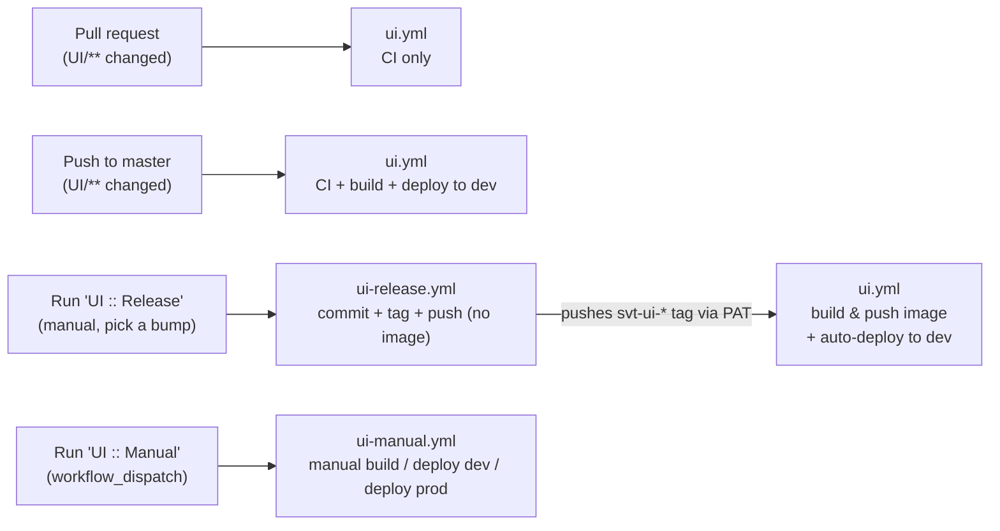
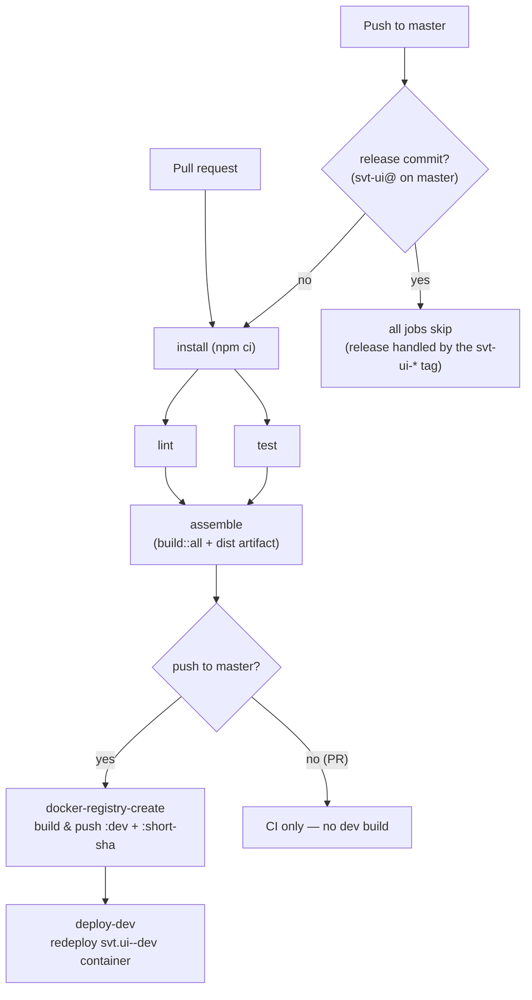
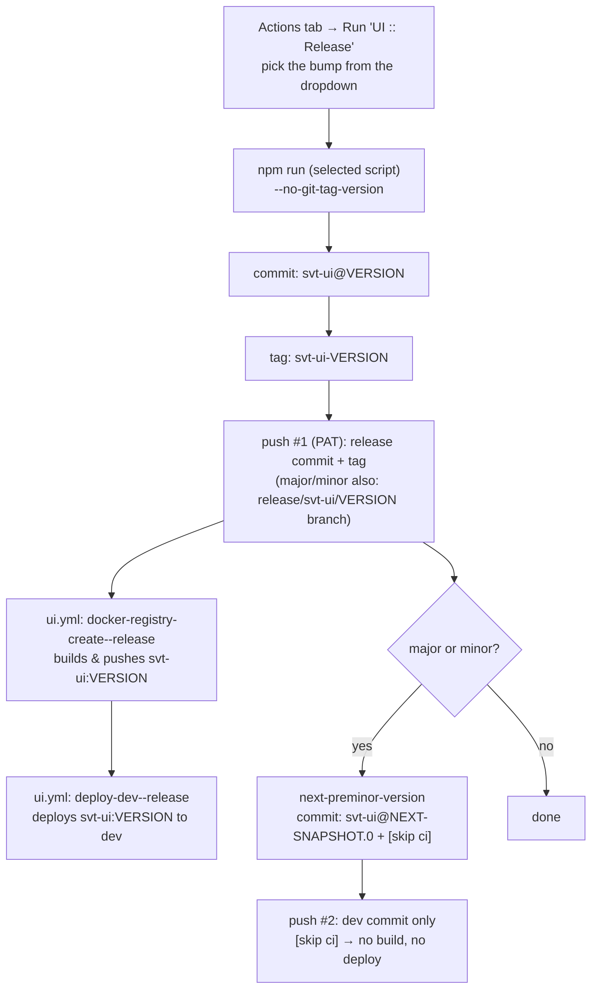
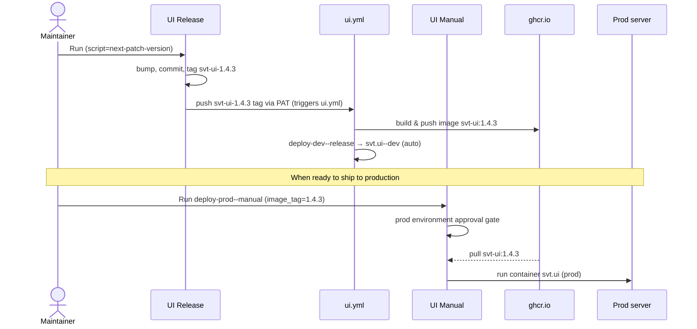

# SVT UI

## Project Overview

This is UI for EpicMeasure project. Project represents **2 services**: front-end (FE) and the back-end (BE) part of the application. 
- **Front-end** part use **Angular** framework. 
- **Back-end** part use **NestJS** framework.

## Project Documentation

| Document | What's in it |
|---|---|
| [docs/ARCHITECTURE.md](docs/ARCHITECTURE.md) | The map — apps, libs, the Kafka layer, request lifecycle, state patterns, ports |
| [docs/RECIPES.md](docs/RECIPES.md) | Step-by-step checklists: new entity end-to-end, new list page, new lib, NgRx store, dialogs, running locally |
| [CLAUDE.md](CLAUDE.md) | Conventions and gotchas (also auto-loaded by Claude Code) |
| This file | Environment, commands, CI/CD and the release process |

## Environment Requirements

- [Node.js](https://nodejs.org/en/]sdcsdscsdc) ^20.19.0 (20.19@latest is good enough)

## Development

- Ensure that you have install all the dependencies: `npm install`
- Start both FE and BE: `npm run start` => browser will be open automatically `http://localhost:7755/app`
- Start FE: `npm run start::ui` => the app will be running: `http://localhost:7755/app`
- Start BE: `npm run start::api` => the app will be running: `http://localhost:9393/api`

> **_NOTE:_**  
> Kafka broker should be running before yuo start project (BE side).

## How To Build the app

- `npm install`
- `npm run build::all`
- Build result will be placed in the folder `dist/apps`

## Epic DB Agent

Fake db agent, used just for testing purposes. You can run the project with the command: start::db-agent

## Docker


```
# Build
docker build -t epic-measure .

# Run (default port 8080)
docker run -p 8080:8080 epic-measure

# Run with custom port and env vars
docker run -p 3000:3000 \
  -e SVT_UI_PORT=3000 \
  -e KAFKA_BROKER=kafka.prod:9092 \
  -e SVT_UI_API_PORT=9393 \
  epic-measure

# Push to registry
docker tag epic-measure your-registry.com/epic-measure:latest
docker push your-registry.com/epic-measure:latest
```

## GitHub Actions (CI/CD)

All UI automation lives in [`.github/workflows`](../.github/workflows):

| Workflow file | Trigger | Purpose |
|---|---|---|
| `ui.yml` | PR, push to `master`, `svt-ui-*` tag | CI (PR + master); dev build & deploy on master pushes and on `svt-ui-*` tags |
| `ui-release.yml` (`UI :: Release`) | Manual (`workflow_dispatch`) | Create a release: bump → commit + tag + push (no image; `ui.yml` builds it from the tag) |
| `ui-manual.yml` (`UI :: Manual`) | Manual (`workflow_dispatch`) | Manual ops: build a short-SHA image, deploy an image to dev, deploy a release to prod |

> `ui.yml` runs for PRs/pushes only when they touch `UI/**` or `.github/workflows/ui.yml`.
> (Per GitHub, path filters are **not** evaluated for tag pushes.)
>
> `UI :: Release` only creates the commit + tag; **`ui.yml` builds the release image** when the
> `svt-ui-*` tag is pushed. That push must use a **`RELEASE_PAT`** secret — a tag pushed with the
> default `GITHUB_TOKEN` does not trigger other workflows.
>
> Images are published to `ghcr.io/svt-wp2/svt-ui`.

### Triggers overview



### Scenario 1 — Pull request

A PR touching `UI/**` runs **CI only**: `install → lint + test → assemble`. No image is built and
nothing is deployed.

### Scenario 2 — Push to master

The same CI runs, then the image is built and **deployed to dev automatically**.



- `docker-registry-create` pushes `ghcr.io/svt-wp2/svt-ui:dev` and `:<short-sha>` (with `APP_VERSION=<short-sha>`).
- `deploy-dev` redeploys the `svt.ui--dev` container on the self-hosted runner.
- **Release commits are a no-op here:** every job skips `svt-ui@` master-push commits (the gate above),
  so a release never triggers CI or a dev build/deploy on `master` — the `svt-ui-*` tag does the build +
  dev-deploy (Scenario 3).

### Scenario 3 — Create a release

Releases are **manual**: **Actions → `UI :: Release` → Run workflow → pick the bump from the `script`
dropdown → choose the branch (usually `master`) → Run.**

`UI :: Release` does **git only** — bump, commit, tag, push. It builds **no** image. Pushing the
`svt-ui-*` tag triggers `ui.yml`'s `docker-registry-create--release`, which builds and pushes the image.
This needs a **`RELEASE_PAT`** secret (a tag pushed with `GITHUB_TOKEN` would not trigger `ui.yml`).

| `script` choice | `0.1.2` becomes | Tag (pushed) | Image (`ui.yml` builds on the tag) | 2nd commit (`[skip ci]`) |
|---|---|---|---|---|
| `next-major-version` | `1.0.0` | `svt-ui-1.0.0` | `svt-ui:1.0.0` + `:latest` | `svt-ui@1.1.0-SNAPSHOT.0` |
| `next-minor-version` | `0.2.0` | `svt-ui-0.2.0` | `svt-ui:0.2.0` + `:latest` | `svt-ui@0.3.0-SNAPSHOT.0` |
| `next-patch-version` | `0.1.3` | `svt-ui-0.1.3` | `svt-ui:0.1.3` + `:latest` | — |
| `next-preminor-version` | `0.2.0-SNAPSHOT.0` | `svt-ui-0.2.0-SNAPSHOT.0` | `svt-ui:0.2.0-SNAPSHOT.0` | — |
| `next-snapshot-version` | `0.1.3-SNAPSHOT.0` | `svt-ui-0.1.3-SNAPSHOT.0` | `svt-ui:0.1.3-SNAPSHOT.0` | — |



Key points:

- `UI :: Release` builds **no** image — `ui.yml` does, triggered by the `svt-ui-*` tag. This needs a
  **`RELEASE_PAT`** secret (classic PAT with `repo`, or fine-grained with Contents: Read and write).
- **Major/Minor** open the next dev cycle with a **second, separate push**: a `svt-ui@…-SNAPSHOT.0`
  commit carrying `[skip ci]` (on its own line, hidden from the one-line log). It is **not tagged** and
  **not built/deployed** — `[skip ci]` stops it from triggering any `ui.yml` run.
- **Major/Minor** also create a `release/svt-ui/<version>` branch pointing at the release commit
  (pushed atomically with the tag, before `master` advances to the SNAPSHOT). It's a stable pointer for
  that release and doesn't trigger CI — `ui.yml` only watches `master`.
- The image is built from the **released** commit (push #1), so e.g. `svt-ui:2.0.0` contains `2.0.0` —
  not the snapshot.
- Every release **auto-deploys to dev**: after the image is built, `deploy-dev--release` runs it on the
  `svt.ui--dev` container (any release type, including SNAPSHOTs). Prod stays manual (Scenario 4).
- `:latest` is moved only by **stable** releases (`next-major-version` / `next-minor-version` /
  `next-patch-version`); the SNAPSHOT bumps (`next-preminor-version` / `next-snapshot-version`) don't touch it.
- Releases **skip CI**: the `svt-ui-*` tag build (`docker-registry-create--release` →
  `deploy-dev--release`) runs **without** install/lint/test/assemble — those already ran on `master`
  before the release was cut. The release commit's own master push is a no-op (all jobs skip `svt-ui@`
  commits; a skipped run entry still shows). Full CI (incl. `assemble`) runs on PRs and normal master pushes.
- The workflow must exist on the **default branch** for its Run button to appear, and it pushes
  straight to the branch you run it from.

### Scenario 4 — Deploy a release to production

Dev is deployed automatically — on every master push (Scenario 2) **and on every release** (via `deploy-dev--release`). **Production is always manual** and gated by the `prod`
environment approval: **Actions → `UI :: Manual` → Run workflow → `job = deploy-prod--manual`,
`image_tag = <version>` (e.g. `1.0.0`).**



### Manual operations (UI :: Manual → Run workflow)

| Job (`job` input) | `image_tag` | What it does |
|---|---|---|
| `docker-registry-create--manual` | ignored | Build & push `:<short-sha>` from the selected ref |
| `deploy-dev--manual` | optional (defaults to short-sha) | Deploy an existing image to **dev** |
| `deploy-prod--manual` | **required** | Deploy an existing release image to **prod** (approval gate) |

> The release image is built by `ui.yml`'s `docker-registry-create--release` whenever a `svt-ui-*` tag
> is pushed — by `UI :: Release` (via `RELEASE_PAT`) or by hand. Without `RELEASE_PAT`, `UI :: Release`
> still creates the tag, but the build won't start until the tag is (re)pushed by a PAT or a user.
