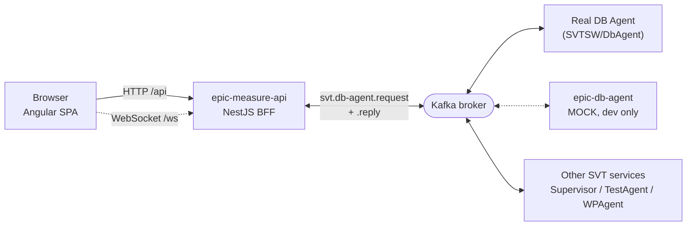
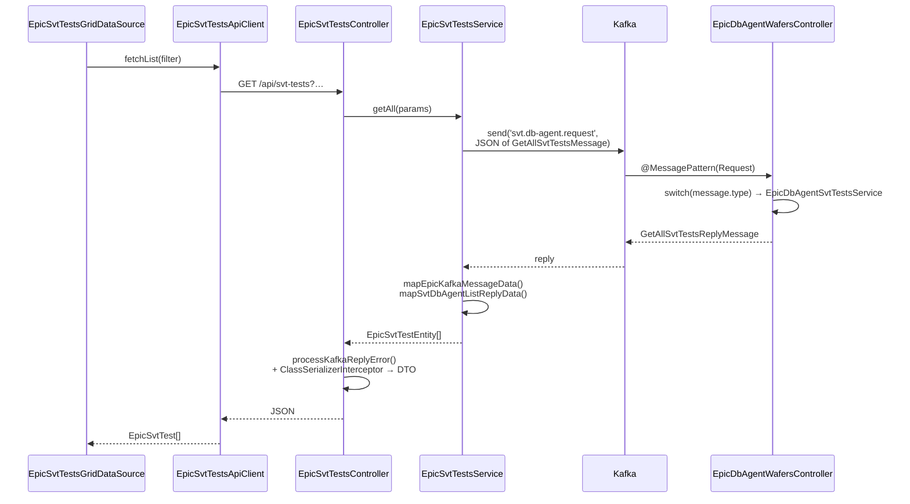

# Architecture Map

Orientation document for the `UI/` Nx workspace. Companion to [RECIPES.md](RECIPES.md) (how to add things)
and [../CLAUDE.md](../CLAUDE.md) (conventions).

## 1. System context

`UI/` is one workspace inside the larger `SVTSW` repo. In production the Angular app and the NestJS BFF
are packaged into a **single container** (nginx serving the SPA + the Node API), which talks to the rest
of the SVT system exclusively over Kafka.



`epic-db-agent` exists so the whole stack can run on a laptop with nothing but a Kafka broker. It implements
the same Kafka contract as the real DB Agent, backed by in-memory arrays.

## 2. Workspace layout

```
UI/
├── apps/
│   ├── epic-measure-ui/      Angular 19 SPA
│   ├── epic-measure-api/     NestJS BFF (HTTP + Kafka client)
│   └── epic-db-agent/        NestJS Kafka microservice — mock DB agent
├── libs/
│   ├── epic/                 Node-side shared code (API ↔ db-agent)
│   │   ├── entities/         DTOs, domain models, Kafka message contracts
│   │   └── core/             low-level helpers (TCP connection factory)
│   └── epic-ui/              Angular-side shared code
│       ├── api/              HTTP clients + view models  (+ __mock__ twins)
│       ├── common/           auth, layout, ag-grid, design-system components
│       ├── shared/<domain>/  feature domain libs (the bulk of the UI)
│       └── utils/            base classes, pipes, directives, material, colors
└── docker/                   nginx template + entrypoint for the prod image
```

**The one hard boundary:** `libs/epic/*` is Node-only and shared by the two NestJS apps.
`libs/epic-ui/*` is Angular-only. They never import each other — the UI has its own view models that
mirror the API's DTO shapes.

## 3. Request lifecycle — one round trip

Following `GET /api/svt-tests` all the way down:



### Files involved, in order

| Step | File |
|---|---|
| Grid data source | `libs/epic-ui/shared/svt-tests/tests/src/services/epic-svt-tests-grid.data-source.ts` |
| HTTP client | `libs/epic-ui/api/main/src/svt-tests/services/epic-svt-tests.api-client.ts` |
| View model | `libs/epic-ui/api/main/src/svt-tests/models/epic-svt-test.models.ts` |
| Controller | `apps/epic-measure-api/src/modules/svt-test/controllers/epic-svt-tests-controller.ts` |
| DTO | `libs/epic/entities/src/svt-tests/dtos/epic-svt-test.dto.ts` |
| Nest service | `apps/epic-measure-api/src/modules/svt-test/services/epic-svt-tests.service.ts` |
| Kafka contract | `libs/epic/entities/src/kafka/db-agent/kafka-messages/svt-db-agent-kafka-svt-tests.ts` |
| Mock handler | `apps/epic-db-agent/src/modules/db-agent/services/epic-db-agent-svt-tests.service.ts` |

## 4. The Kafka layer

Everything goes through **two topics**, declared in
`libs/epic/entities/src/kafka/db-agent/kafka-messages/svt-db-agent-kafka.ts`:

```ts
svt.db-agent.request         // API → DB Agent
svt.db-agent.request.reply   // DB Agent → API  (NestJS request/response convention)
```

### Message envelope

Every message is `{ type, data }`, built from a class so the `type` is impossible to get wrong:

```ts
export class GetAllSvtTestsMessage extends EpicKafkaMessageClass<GetAllSvtTestsData> {
    readonly type = MessageType.GetAllSvtTests
}
```

Per domain there is one namespace (`SvtDbAgentKafkaSvtTests`) holding: a `MessageType` enum, request +
reply data types, request + reply classes, and the `RequestMessage | ReplyMessage | Message` unions.

### Standard reply shapes

| Shape | Type | Unwrap with |
|---|---|---|
| List | `{ items: T[], totalCount?: number }` | `mapSvtDbAgentListReplyData()` |
| Page | `{ items: T[], totalCount: number }` | — |
| One entity | `{ entity: T }` | `mapSvtDbAgentEntityReplyData()` |

The outer envelope is always unwrapped first with `mapEpicKafkaMessageData()`. Errors surface via
`processKafkaReplyError()` in the controller, which turns a Kafka reply error into an HTTP exception.

### Sending, in the Nest service

```ts
protected sendMessageAndGetReply<TReply>(message: SvtDbAgentKafkaSvtTests.Message): Observable<TReply> {
    return this.kafkaClient.send<TReply>(SvtDbAgentKafka.TopicName.Request, JSON.stringify(message))
}
```

Note the manual `JSON.stringify`. Each service must also `subscribeToResponseOf(TopicName.Request)` in
`onModuleInit()`.

### Receiving, in the DB Agent

There is **one** controller (`epic-db-agent-wafers.controller.ts` — the name is historical; it handles
everything) with a single `@MessagePattern(SvtDbAgentKafka.TopicName.Request)` and a big `switch` on
`message.type` dispatching to per-domain services.

> The authoritative contract lives outside this workspace, in
> `../Documentation/Kafka/SvtKafkaConventions.md` and `svt.db-agent.kafka.yaml`. Consult it before adding
> a message type.

## 5. NestJS API structure

Uniform per module under `apps/epic-measure-api/src/modules/<domain>/`:

```
controllers/     thin — validate, delegate, serialize; one per resource
services/        Kafka messaging; returns Observables of entities
models/          the DI token for the Kafka client (SERVICE_NAME)
epic-<x>.module.ts   registers ClientsModule.registerAsync (Kafka) + providers
index.ts
```

Bootstrap (`main.ts`) sets: global prefix `api`, extended query parser, a whitelisting/transforming
`ValidationPipe`, 50 MB body limit, `WsAdapter` for WebSockets, Swagger at `/api/swagger`, and connects the
Kafka microservice with consumer group `epic-ui`.

Controllers use `@UseInterceptors(ClassSerializerInterceptor)` + `@SerializeOptions({ type: XxxDto })` so the
DTO class controls what goes over the wire.

Registered modules: `Health`, `IvMnt`, `Tcp`, `Wafers`, `Asics`, `Wp`, `Enums`, `Chips`, `Equipment`, `SvtTest`.

## 6. Angular structure

### App shell

`apps/epic-measure-ui/src/app/`

- `app.routes.ts` — a login route plus an authed `AppLayoutPageComponent` with **lazy-loaded** children.
  Dev-only routes are appended when `!environment.production`.
- `app.module.ts` — providers for router, HTTP, i18n, Material defaults, ECharts, icons, the root NgRx store,
  every `provideEpicXxxStore()`, and conditionally `provideMockData()`.
- `app.mock.providers.ts` — the `EpicXxxApiClient → EpicXxxApiClientMock` swap table.
- `models/app-sidebar-nav.models.ts` — the sidebar menu.

`src/modules/<feature>/` holds **routing + page components only**. Pages are thin: they wire a data source or
store facade to a presentational component from a `shared` lib.

### Feature domain libs

`libs/epic-ui/shared/<domain>/` — the standard skeleton (take only what you need):

```
src/
├── components/    presentational, @Input/@Output only
├── dialogs/       Material dialog wrappers
├── forms/         reactive forms + a *.factory.ts building the FormGroup
├── models/        *-grid.models.ts (AG Grid ColDefs), form/dialog models
├── services/      *-grid.data-source.ts, *-data.facade.ts, *-dialog.service.ts
├── store/         actions/ effects/ selectors/ + <x>.store.ts + services/<x>.store.facade.ts
├── epic-<x>-store.providers.ts    provideEpicXxxStore()
└── index.ts
```

`svt-tests` is split into four aliased entry points — `main` (test setups), `test-types`, `test-templates`,
`tests` — a useful precedent when a domain gets large.

### State management

**Pattern A — `SimpleDataSource`** (`libs/epic-ui/utils/main/src/models/search-query/simple-data-source.model.ts`)

An abstract class managing `{ data, loadingProcessing }` plus a filter subject. Subclass it, implement
`getDataObserver()`, and the page calls `connect()` / `load()` / `setFilter()` / `disconnect()`. This is the
lightweight default for grids.

```ts
@Injectable({ providedIn: 'root' })
export class EpicSvtTestsGridDataSource extends SimpleDataSource<EpicSvtTestsGrid.RowEntity[], Filter> {
    protected readonly api = inject(EpicSvtTestsApiClient)
    protected override getDataObserver(filterValue: Filter): Observable<EpicSvtTestsGrid.RowEntity[]> {
        return this.api.fetchList(filterValue)
    }
}
```

**Pattern B — NgRx feature store**

For entities many pages read and that are worth caching. Uses `@ngrx/entity` adapters, and a `ProcessingStore`
helper that tracks `{ inProgress, error }` per operation. Effects short-circuit on `isAllDataFetched` unless
`force` is passed. A `*.store.facade.ts` hides the store from components by dispatching a request action and
returning an Observable that resolves on the matching success/error action.

Currently registered stores: wafer types, wafer tests, WP, SVT test setups, SVT test types.

**Pattern C — `BaseEntitiesListCachedFacade`** — a trivial in-memory cache for reference lists.

### Grids

AG Grid is the workhorse. Each list has a `*-grid.models.ts` namespace exposing `ColId`, `RowEntity`,
`CellEventEvent`, `getColDefs()` and `getGridOptions()` (spreading `EpicAgGrid.getDefaultGridOptions()`).
Row actions are declared as cell schemas (`AgIconActionsCell.getCellSchema`) and surface as a single
`onCellEvent` switch in the component.

## 7. Path aliases

Defined in `tsconfig.base.json`. Always import through these.

| Alias | Points at |
|---|---|
| `@env`, `@env/*` | `apps/epic-measure-ui/src/environments` |
| `epic/core`, `epic/entities` | `libs/epic/*` (Node side) |
| `epic-ui/api`, `epic-ui/api/__mock__` | HTTP clients + view models |
| `epic-ui/common`, `.../auth`, `.../ag-grid`, `.../components`, `.../layout` | design system |
| `epic-ui/utils`, `.../colors`, `.../material` | base classes and helpers |
| `epic-ui/shared/<domain>` | feature libs — `wafers`, `wafer-tests`, `wafer-types`, `asics`, `asic-tests`, `chips`, `wp`, `equipment`, `equipment-types`, `iv-mnt`, `kafka`, `tcp`, `location` |
| `epic-ui/shared/svt-tests` | SVT test **setups** |
| `epic-ui/shared/svt-test/test-types` | SVT test types |
| `epic-ui/shared/svt-test/test-templates` | SVT test templates |
| `epic-ui/shared/svt-test/tests` | SVT test **runs** |

> The `svt-tests` aliases are inconsistent (`svt-tests/…` vs `svt-test/…`). That's the state of the file,
> not a typo to fix casually — changing it touches every importer.

## 8. Ports & environment

| Thing | Where | Value |
|---|---|---|
| Angular dev server | `apps/epic-measure-ui/project.json` | 7755, baseHref `/app/` |
| Dev proxy `/api` → | `apps/epic-measure-ui/proxy.conf.json` | `http://localhost:7373` |
| API dev port | `apps/epic-measure-api/.env.development` | `SVT_UI_API_PORT=7373` |
| API fallback port | `apps/epic-measure-api/src/main.ts` | 9393 |
| Kafka broker (dev) | `.env.development`, both Nest apps | `localhost:9095` |
| Kafka broker (compose-internal) | `docker-compose.yml` | `kafka:9096` |
| Kafka UI | `docker-compose.yml` | http://localhost:8088 |
| Prod container | `docker-compose.yml` | UI 8096, API 9393, `KAFKA_BROKER=kafka:9096` |

`.env.{development,production,test}` are committed for both Nest apps — they hold ports and broker
addresses only.

Consumer groups: `epic-ui` (API), `epic-ui.fake-db-agent` (mock agent).

## 9. Build & test

- Angular build: `@angular-devkit/build-angular:application` → `dist/apps/epic-measure-ui`.
  Production swaps `environment.ts` → `environment.prod.ts`.
- API/db-agent build: `webpack-cli` via `nx:run-commands`.
- Tests: Jest, `jest-preset-angular` for UI libs, node env for the Nest side. Each lib has its own
  `jest.config.ts`. Coverage is thin today.
- Husky + lint-staged run on commit; `npm run pre-pull-request` is the gate before a PR.

CI/CD, release flow and the deploy workflows are documented in [../README.md](../README.md).
