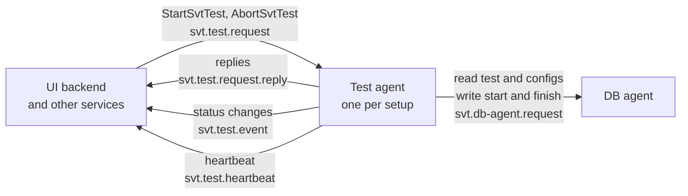
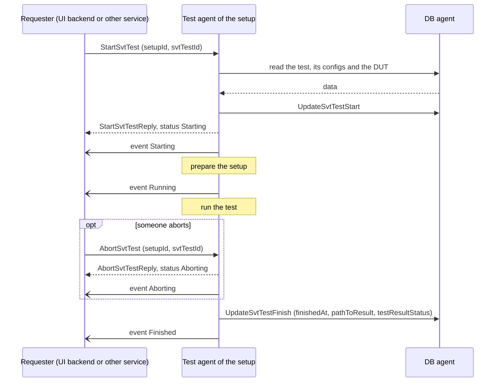
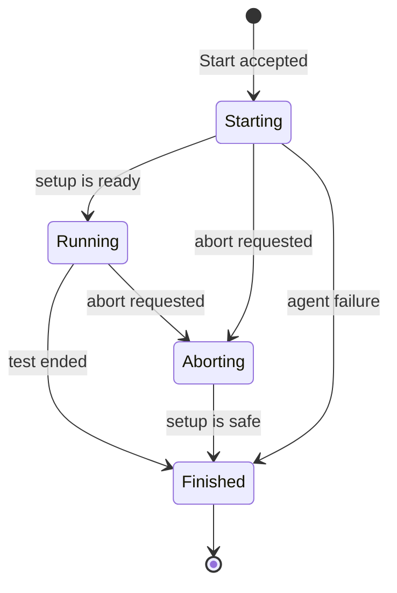
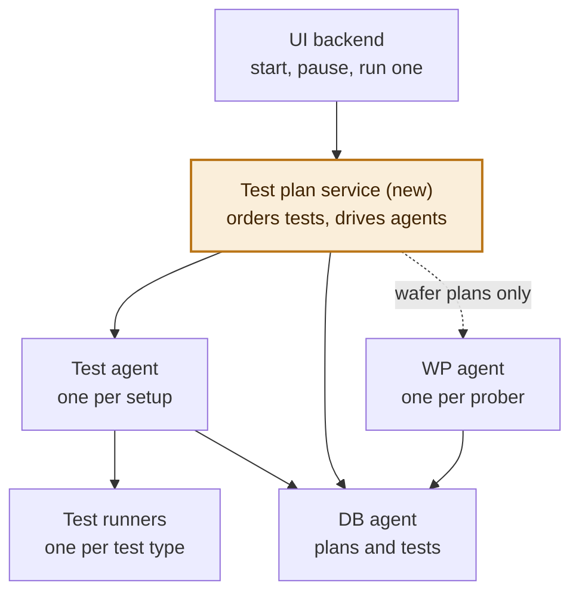
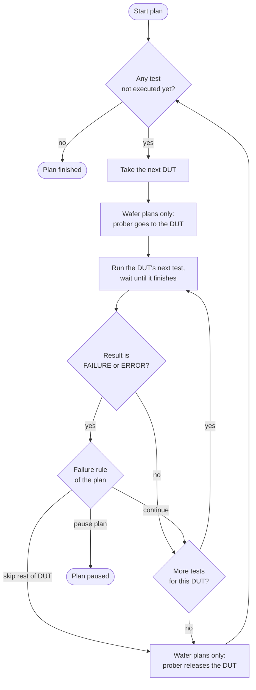
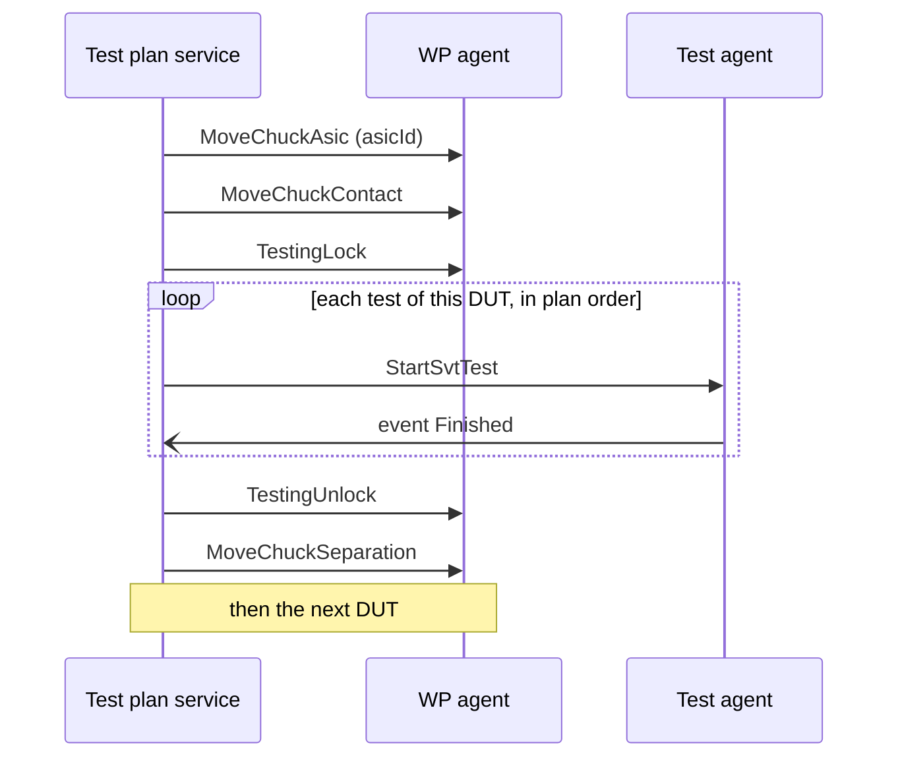

# SVT test processing: session summary

Sessions on 2026-09-24 and 2026-09-30, between Oleksandr Korchak and Claude.

The diagrams are written in Mermaid. GitHub shows them as pictures. VS Code and JetBrains IDEs need their Mermaid Markdown extension, otherwise you see the diagram source as text.

## Where things stand

| Topic | State |
| --- | --- |
| Kafka contract for running one test | Proposal written in `Documentation/Kafka/svt.test.kafka.yaml`. Not committed. |
| Running many tests as a plan | Brainstormed. A direction is recommended. The proposal is not written yet. |
| Waiting on you | One open question on the contract, eight choices to review, three decisions for the plan proposal. |

Terms used below:

- **DUT**: device under test. It is an Asic, a Chip or a ChipBlock.
- **Setup**: a test bench, stored in the DB as `SvtTestSetup`.
- **Test agent**: the new service that executes tests. One runs per setup.
- **DB agent**: the existing service in front of the database (`svt.db-agent.*`).
- **WP agent**: the existing service that drives a wafer prober (`svt.wp-agent.*`).
- **UI backend**: the NestJS service between the browser and Kafka.

---

## Part 1. Running one test (contract written)

### What the contract is for

1. A user creates an SvtTest in the DB.
2. Someone asks a test agent to run it.
3. The agent reads the test, its configs and the DUT from the DB agent and runs the test.
4. While it runs, the agent publishes its status.
5. At the end the agent writes the result back through the DB agent.

### Decisions you made

| Question | Your decision |
| --- | --- |
| How many agents | One agent per setup |
| Who can start a test | The UI, one test at a time, and other services |
| Agent is already busy | The request is rejected. Nothing is queued. |
| Extra features in version 1 | Abort and heartbeat. No step progress and no log streaming. |
| Topic prefix | `svt.test.*` |
| Result of an aborted run | A new value `ABORTED` in the DB enum `testResultStatus` |
| How refusals are reported | The existing reply statuses plus a numeric `error.code` |

### Who talks to whom

### Topics and messages

| Topic | Messages | Who sends | Content |
| --- | --- | --- | --- |
| `svt.test.request` | `StartSvtTest`, `AbortSvtTest` | UI backend or another service | `setupId`, `svtTestId` |
| `svt.test.request.reply` | `StartSvtTestReply`, `AbortSvtTestReply` | The agent of that setup | The test's processing state, or an error |
| `svt.test.event` | `SvtTestProcessingStatusChanged` | Every agent | The full processing state on every status change |
| `svt.test.heartbeat` | `SvtTestAgentHeartbeat` | Every agent, every 5 s | Agent name, setup, status, the test it is running |

Routing rules:

- All agents read the same request topic, each with its own consumer group, so every agent sees every command.
- An agent handles and answers only the commands that carry its own `setupId`.
- If the agent of that setup is offline, nobody answers. Callers need a timeout; 15 s is recommended.
- An agent skips old commands when it starts, so a command sent while it was offline never runs later.

### How one run goes

Two points about the order:

- The reply to Start comes after the checks and after the test is marked as started in the DB. It does not wait for the test to end.
- `Finished` is published only after the result is stored in the DB, so whoever reacts to it can read the final test from the DB.

### Statuses

| Kind | Values | Meaning |
| --- | --- | --- |
| Processing status | `Starting`, `Running`, `Aborting`, `Finished` | Where the run is. `Finished` is the only final status. |
| Test result | `SUCCESS`, `PARTIAL_SUCCESS`, `FAILURE`, `ERROR`, `ABORTED` | How the run ended. `ABORTED` is new. `ERROR` also covers failures of the agent itself. |
| Agent status in the heartbeat | `Idle`, `Busy`, `Error` | An agent counts as offline when three heartbeats in a row are missing. |

### Error codes

| Code | Name | Reply status | Meaning |
| --- | --- | --- | --- |
| 1001 | InvalidMessage | BadRequest | Unknown message type, broken JSON or missing fields |
| 1002 | SvtTestNotFound | NotFound | The test does not exist |
| 1003 | SetupMismatch | BadRequest | The test belongs to another setup than `setupId` |
| 1004 | SvtTestAlreadyStarted | BadRequest | The test was already started or finished |
| 1005 | InvalidTestConfig | BadRequest | A config body cannot be read or is not valid for the agent |
| 1006 | UnsupportedTestType | BadRequest | The agent cannot run this test type |
| 1007 | SvtTestNotRunning | BadRequest | Abort of a test the agent is not running |
| 2001 | AgentBusy | BadRequest | The agent is running another test |
| 2002 | AgentNotReady | UnexpectedError | The agent is in `Error` status |
| 3001 | DbAgentUnavailable | UnexpectedError | The DB agent did not answer in time |
| 3002 | DbAgentError | UnexpectedError | The DB agent answered with an error |
| 4001 | ExecutionFailed | events only | The run failed on the agent side; result is `ERROR` |
| 4002 | ExecutionInterrupted | events only | The agent restarted during the run; result is `ERROR` |
| 9999 | UnexpectedError | UnexpectedError | Anything else |

### Choices I made that you have not confirmed

1. **Command names.** `StartSvtTest` and `AbortSvtTest`, to match the Start button in the UI and `UpdateSvtTestStart` in the DB agent.
2. **Routing.** Every command carries `setupId` and `svtTestId`. See the open question below.
3. **When `startedAt` is written.** When the request is accepted, before the reply. This blocks a second start and lets the UI show the test as running at once.
4. **One SvtTest is one execution.** Running it again means creating a new SvtTest. Part 2 relaxes this for tests aborted by a pause.
5. **Only four processing statuses.** Whether the test passed, failed or was aborted is only in `testResultStatus`.
6. **How events are documented.** The message is the request body and the response is "204 No reply". This follows the header of the DB agent file. The WP agent file puts the message under the response instead.
7. **No status query command.** The heartbeat carries the running test, so a reloaded UI sees it within one heartbeat.
8. **Reply header `kafka_nest-is-disposed`.** NestJS only completes a request when a reply carries it. The DB agent already sends it.

### Open question: `setupId` in the Start message

You pointed out that an SvtTest already knows its setup through its setup config, so `setupId` in the payload is redundant. That is true. The agent does not use the value for processing. It is only an address.

| | Keep `setupId` (my recommendation) | Drop it |
| --- | --- | --- |
| Who works on a Start | Only the agent of that setup | Every online agent asks the DB agent to find out whose test it is |
| Test does not exist, or DB agent is down | The addressed agent answers with an error | Nobody can tell it owns the request. Either nobody answers, or every agent does. |
| Extra work for the caller | Must know the setup. The UI already does: the tests grid resolves it for the Test Setup column. | None |
| Risk of a wrong value | A caller bug. The agent checks against the DB and answers `1003`. | None |

Nothing is decided yet. If it stays, the contract should say plainly that the field is a routing address only.

### Things outside the contract that block or affect the agent

- **DB agent.** On `master` it does not implement `GetAllSvtTests`, `CreateSvtTest`, `UpdateSvtTestStart` or `UpdateSvtTestFinish`. They exist only as empty stubs on the unmerged branch `origin/289-db-test-list`.
- **DB.** The enum `testResultStatus` needs the new value `ABORTED`.
- **UI backend.** It waits for a Kafka reply forever. It needs a timeout before it calls the agent, because an offline agent never answers.
- **UI.** Its result values (None, Completed, Failed, Cancelled) do not match the DB enum. The Start and Stop buttons in the tests grid are not handled, and the Stop button sends the Start event.
- **Docs.** `svt.db-agent.kafka.yaml` describes the `id` of the start and finish updates as "Test template id." and their dates as date only. `SvtKafkaConventions.md` covers only request and reply, not events or heartbeats.

### How the contract file was checked

- A local script confirmed that the YAML parses, that every reference resolves and that the error codes in the table and the descriptions agree.
- It has not been opened in the Swagger editor.
- It is not committed.

---

## Part 2. Running many tests as a plan (brainstorm)

### What you want

- Start many tests for one DUT in one go.
- Later: run a plan over a whole wafer. Tests are grouped by DUT and the prober moves from DUT to DUT.
- Start and pause a plan. Pause means: abort the running test and stop.
- Run one single test of a plan by hand, without starting the whole plan.
- Possibly several test implementations per test type in future.

### Decisions you made

| Question | Your decision |
| --- | --- |
| After a pause, what happens to the aborted test | It goes back to "not executed" and is run again first |
| A test ends with `FAILURE` or `ERROR` | What happens to the rest of that DUT's tests is set per plan: continue, skip the rest of the DUT, or pause the plan |
| Order of tests within a DUT | The user arranges it when building the plan |
| Tests outside any plan | They still exist |

### Recommended direction

A new DB entity, the test plan, links existing SvtTests. A new small service, the test plan service, runs a plan one test at a time through the contract from Part 1. The test agent stays as it is.

### How it would work

- **A plan** holds a name, a setup, a failure rule and an ordered list of existing SvtTests. For wafers it would later also hold the wafer and the prober.
- **Start** runs every test of the plan that has not been executed yet, DUT by DUT, in the order you arranged.
- **Pause** aborts the running test, puts it back to "not executed" and stops. Starting again simply continues.
- **Run one** is the same service running a single test of the plan. It is allowed while the plan is not running.
- **No new SvtTest state.** A test is "waiting" when its plan is running and it has not started. The UI can show that from the plan's status.
- **Cost.** Putting an aborted test back needs one new DB agent message. It also relaxes the rule from Part 1 that a test runs only once.

What Start does:

### Why not the other two options

- **Batch inside the test service.** There are already two separate test agent code bases: `TestAgent` for the SLDO bench and `ITS3TestAgent` for MOSAIX. Ordering, pause and prober handling would have to be written in each.
- **A "ready" flag on SvtTest plus a watcher.** The DB agent sends no change notifications, so the watcher would have to poll. A flag on single tests also has no place for the order, the failure rule or the wafer.

### Whole wafer later

The WP agent already has the commands this loop needs:

- `MoveChuckAsic` goes to a DUT by its DB id (`WPAgent/actions/WPTestingActions.py`, line 1331). It checks that the Asic is on the loaded wafer.
- `TestingLock` and `TestingUnlock` were written for an outside test service. The WP agent's state machine already has the path contact, locked, unlocked, separation.

Two gaps to plan for:

- **One user at a time.** The WP agent accepts one logged-in user (`WPAgent/actions/WPLoginActions.py`, line 68). The plan service would have to act as the user who started the plan.
- **No link between a setup and a prober.** Nothing in the DB says which prober serves a setup, so a wafer plan must name the prober itself.

The UI already has an earlier prototype of this idea, `EpicWaferTest`, with `wpMachineId`, `waferId`, a list of Asics, start and abort. It runs on mock data only. The plan could replace it.

### Several test services per test type

Keep one communication layer for all tests. The contract is already independent of the test type: it carries only `svtTestId`, and the type comes from the DB.

- **Inside the agent**, a thin Kafka layer picks a runner. A runner is the script or program that performs one type of test. Both existing code bases already work like this internally.
- **Not two services on one setup.** A bench runs one test at a time, so one process has to own "busy".
- **A team that wants its own service** gets its own setup in the DB and implements the same contract.
- **One addition to the contract:** the heartbeat should list the test types the agent supports.

### Decisions needed before the plan proposal is written

1. **Should every run request from the UI go through the plan service,** including single tests and tests outside any plan? I recommend yes. Otherwise a direct start can land on a setup between two tests of a plan. On a wafer that means while the prober is moving.
2. **Where does the plan service live?** `SVTSupervisor/` is an empty placeholder folder. A NestJS app in the UI workspace would reuse the existing Kafka types. This also decides the topic prefix: `svt.test-plan.*` or `svt.supervisor.*`.
3. **Should the first proposal already include the wafer fields and prober steps,** or only plans without a prober?

---

## Background: what exists in the repo today

| Area | What I found |
| --- | --- |
| `TestAgent/` | An early Kafka prototype for the SLDO bench. It runs only against an emulator. It uses `svt.test-agent.*` topics with a message shape that does not follow the conventions, and it cannot talk to the real DB agent. |
| `ITS3TestAgent/` | The real MOSAIX wafer runner, a command line script. It drives the prober itself through the WP agent. It does not use the DB agent and publishes no status. Its overall result values match the DB enum `testResultStatus`. |
| `WPAgent/` | Has the navigation and lock commands listed above. Its YAML contract is out of date compared with the code. |
| `DbAgent/` | Publishes only replies and a heartbeat. It sends no change notifications. |
| `UI/` | The browser never talks to Kafka; everything goes through the UI backend. The UI does not talk to the WP agent at all. No live push to the browser works today. The UI backend already marks the place where a live "Running" state should be merged in. |
| `SVTSupervisor/` | Empty placeholder, only the initial commit. |

## Next steps

1. Decide the open question on `setupId`.
2. Review the eight choices in Part 1 and say which to change.
3. Decide the three points at the end of Part 2.
4. Then the plan proposal can be written, in the same style as `svt.test.kafka.yaml`, together with the DB agent additions it needs.
